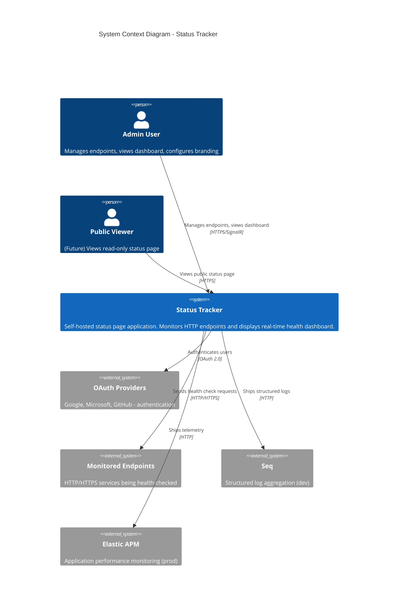
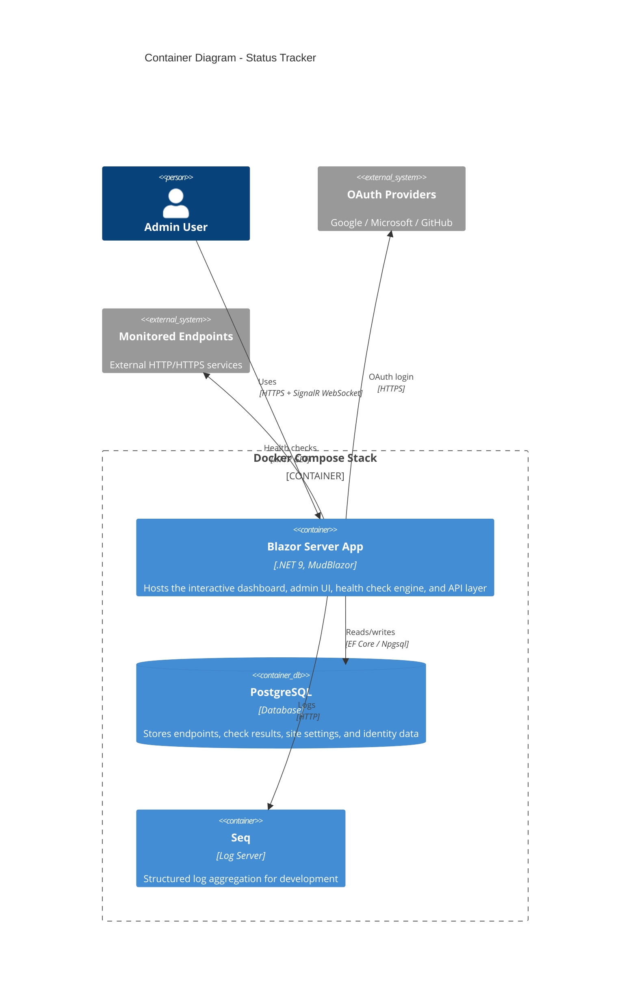
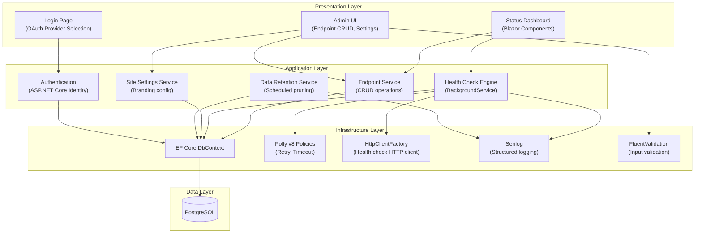
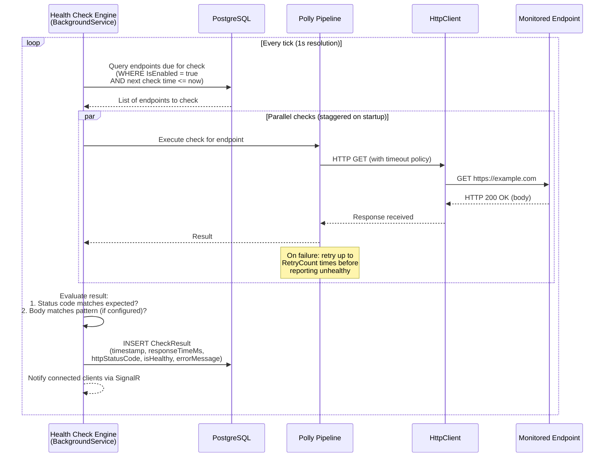
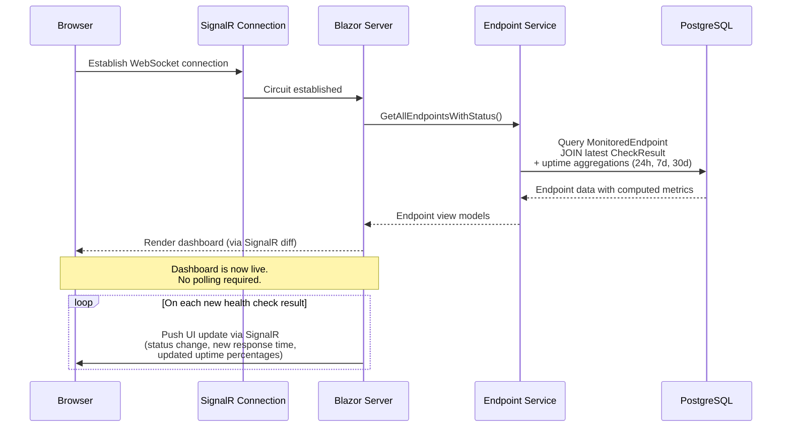
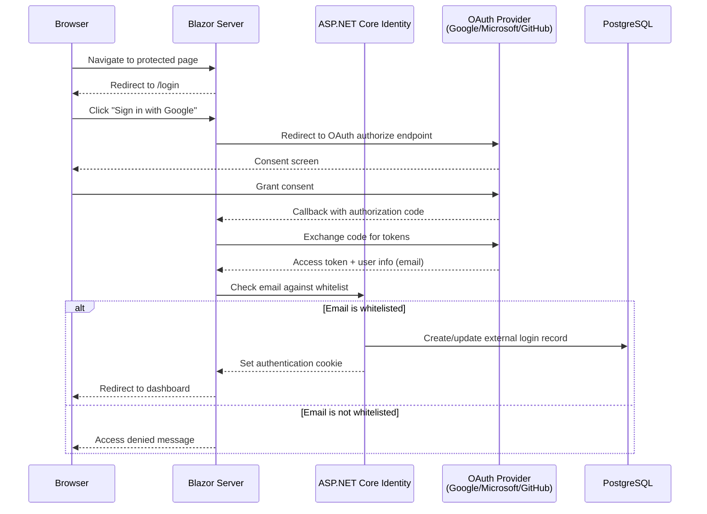
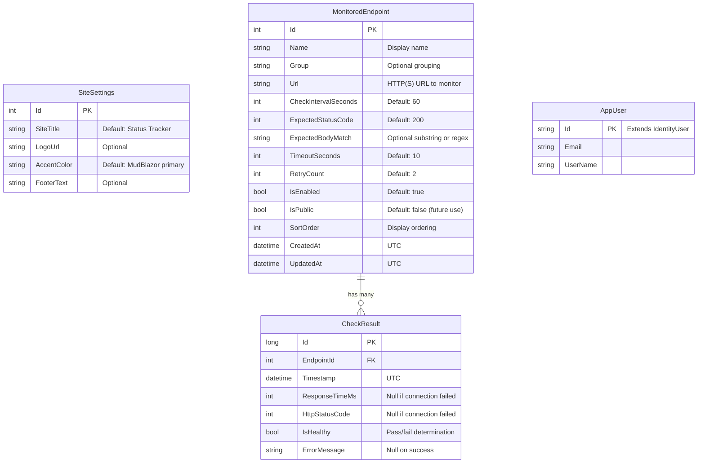
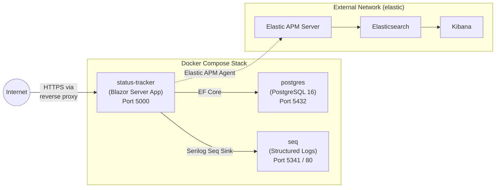

# Architecture Document

## Status Tracker

**Version:** 1.0  
**Date:** 2026-04-11  
**Status:** Draft

---

## 1. System Overview

Status Tracker is a self-hosted status page application built with .NET 9 and Blazor Server. It monitors HTTP/HTTPS endpoints on configurable intervals, records health check results in PostgreSQL, and presents a real-time dashboard via SignalR. The application follows a **fork-and-deploy** model: all configuration (endpoints, branding, secrets) is driven by the database and environment variables, so a new user can clone the repository, set environment variables, run `docker compose up`, and have a working status page with zero source code changes.

### Design Principles

- **Generic by default** -- no hardcoded project names, URLs, or branding in source code
- **Database-driven configuration** -- monitored endpoints and site branding are rows in PostgreSQL, not YAML/JSON files
- **Environment-driven secrets** -- OAuth credentials, connection strings, and email whitelists come from environment variables
- **Single-command deployment** -- Docker Compose brings up the entire stack

---

## 2. High-Level Architecture

### C4 Context Diagram



### C4 Container Diagram



---

## 3. Component Architecture

The Blazor Server application is organized into the following logical layers and components:



### Component Responsibilities

| Component | Responsibility |
|-----------|---------------|
| **Status Dashboard** | Real-time display of all endpoint statuses, uptime percentages (24h/7d/30d), uptime history timeline, response time charts. Updates via SignalR. |
| **Admin UI** | CRUD forms for MonitoredEndpoint management, SiteSettings branding editor, endpoint list with inline enable/disable toggle. |
| **Login Page** | Renders OAuth provider buttons dynamically based on which providers have credentials configured via environment variables. |
| **Health Check Engine** | `BackgroundService` that schedules and executes HTTP health checks against all enabled endpoints at their configured intervals. |
| **Endpoint Service** | Business logic for endpoint CRUD operations, validation orchestration, and query methods for the dashboard. |
| **Site Settings Service** | Reads and writes the single-row `SiteSettings` table; provides branding values to the Blazor layout. |
| **Data Retention Service** | `BackgroundService` (or scheduled job) that prunes `CheckResult` rows older than the configured retention period (default 90 days). |
| **Authentication** | ASP.NET Core Identity with external OAuth login providers; email whitelist enforcement. |
| **Polly Policies** | Configures per-endpoint retry (default 2 retries) and timeout (default 10s) policies for health check HTTP requests. |
| **FluentValidation** | Validates endpoint configuration (URL format, interval ranges, status code validity) before persistence. |
| **Serilog** | Structured logging with pluggable sinks; Seq for development, Elastic APM for production. |

---

## 4. Data Flows

### 4.1 Health Check Cycle

This is the primary automated workflow of the application. The health check engine runs continuously as a `BackgroundService`, polling endpoints at their individually configured intervals.



### 4.2 User Request Flow (Dashboard)



### 4.3 Authentication Flow



---

## 5. Data Model



### Data Model Notes

- **SiteSettings** is a single-row table seeded on first application run. It drives the header title, logo, accent color (applied to MudBlazor theme), and footer text. All fields are editable at runtime through the admin UI.
- **CheckResult** is the highest-volume table. At one check per minute per endpoint, 50 endpoints generate approximately 72,000 rows per day. The data retention service prunes records older than 90 days (configurable), capping the table at roughly 6.5 million rows at steady state for 50 endpoints.
- **All timestamps are stored in UTC.** The presentation layer converts to the user's local timezone for display.
- **AppUser** extends ASP.NET Core's `IdentityUser` and links to external OAuth logins through the standard Identity tables (`AspNetUserLogins`, `AspNetUserTokens`, etc.).
- **CheckResult.EndpointId** uses a foreign key to `MonitoredEndpoint`. When an endpoint is deleted, associated check results are cascade-deleted or orphaned gracefully.

### Indexing Strategy

| Table | Index | Purpose |
|-------|-------|---------|
| `CheckResult` | `(EndpointId, Timestamp DESC)` | Primary query pattern: latest results per endpoint, time-range aggregations |
| `CheckResult` | `(Timestamp)` | Data retention pruning (DELETE WHERE Timestamp < cutoff) |
| `MonitoredEndpoint` | `(IsEnabled)` | Health check engine queries only enabled endpoints |
| `MonitoredEndpoint` | `(SortOrder, Name)` | Dashboard display ordering |

---

## 6. Infrastructure and Deployment

### Docker Compose Stack



### Deployment Model

| Aspect | Implementation |
|--------|---------------|
| **Container orchestration** | Docker Compose (single host) |
| **Application container** | .NET 9 runtime, Blazor Server app, exposed on port 5000 |
| **Database** | PostgreSQL 16 in a dedicated container with a named volume for data persistence |
| **Log aggregation (dev)** | Seq container for interactive structured log querying |
| **Log aggregation (prod)** | Elastic APM on an external `elastic` Docker network |
| **Reverse proxy** | User-provided (Nginx, Caddy, Traefik) for HTTPS termination -- not included in the Compose stack |
| **Migrations** | EF Core migrations run automatically on application startup; failure prevents startup (fail-fast) |
| **Seed data** | Default `SiteSettings` row seeded on first run if the table is empty |

### Environment Variable Configuration

| Category | Variables | Required |
|----------|-----------|----------|
| **Database** | `POSTGRES_PASSWORD`, connection string | Yes |
| **Auth (Google)** | `GOOGLE_CLIENT_ID`, `GOOGLE_CLIENT_SECRET` | At least one provider required |
| **Auth (Microsoft)** | `MICROSOFT_CLIENT_ID`, `MICROSOFT_CLIENT_SECRET` | At least one provider required |
| **Auth (GitHub)** | `GITHUB_CLIENT_ID`, `GITHUB_CLIENT_SECRET` | At least one provider required |
| **Access control** | `ALLOWED_EMAILS` (comma-separated) | Yes |

OAuth providers are enabled dynamically: if both client ID and client secret are present for a provider, it appears on the login page. No code changes or feature flags are needed.

---

## 7. Technology Stack

| Layer | Technology | Rationale |
|-------|-----------|-----------|
| **Runtime** | .NET 9 | Latest framework release; high performance, mature ecosystem, cross-platform |
| **UI framework** | Blazor Server (InteractiveServer) | Real-time SignalR updates without a JavaScript framework; server-side rendering simplifies authentication |
| **Component library** | MudBlazor | Material Design components with rich data tables, forms, theming, and dialog support |
| **Charts** | ApexCharts (Blazor wrapper) | Interactive response time and uptime visualizations; lightweight with good Blazor bindings |
| **ORM** | Entity Framework Core | Code-first migrations, LINQ queries, strong PostgreSQL support via Npgsql provider |
| **Database** | PostgreSQL | Robust open-source RDBMS; handles time-series-like check result data well; partitioning support for future scale |
| **HTTP resilience** | Polly v8 | Retry and timeout policies for health check HTTP calls; first-class `HttpClientFactory` integration |
| **Validation** | FluentValidation | Expressive, testable validation rules for endpoint configuration; cleaner than data annotations for complex rules |
| **Authentication** | ASP.NET Core Identity + OAuth | Built-in external login provider support; no custom auth implementation needed |
| **Logging** | Serilog | Structured logging with pluggable sinks (Seq for dev, Elastic APM for prod) |
| **Containerization** | Docker + Docker Compose | Single-command deployment; reproducible environments; standard in the self-hosted ecosystem |

---

## 8. Key Design Decisions and Trade-offs

### ADR-1: Blazor Server over Blazor WebAssembly

**Decision:** Use Blazor Server (InteractiveServer render mode) instead of Blazor WebAssembly.

**Rationale:**
- Real-time dashboard updates are a core requirement. Blazor Server provides native SignalR push without additional infrastructure.
- Server-side rendering simplifies authentication (cookies, session, Identity integration).
- No CORS or API gateway complexity -- the UI and backend share the same process.

**Trade-off:** Each connected browser maintains a SignalR WebSocket connection and server-side circuit, consuming memory and connections. This limits horizontal scaling without sticky sessions and constrains the number of concurrent viewers. For v1 (admin-only, small team), this is acceptable. A future public status page could use static SSR or Blazor WebAssembly to decouple viewer scale from server resources.

---

### ADR-2: Database-Driven Configuration over Config Files

**Decision:** Store all monitored endpoints and site branding in PostgreSQL, manageable via the admin UI.

**Rationale:**
- Eliminates the need for users to maintain YAML/JSON configuration files.
- Runtime changes (add endpoint, change branding) take effect without application restarts.
- Supports the fork-and-deploy model -- no config files to customize after cloning.

**Trade-off:** Users who prefer infrastructure-as-code workflows cannot simply edit a config file and redeploy. Mitigation: endpoints can be seeded directly in the database, and a future version could add import/export capabilities.

---

### ADR-3: Email Whitelist over Open Registration

**Decision:** Restrict access to a whitelist of email addresses rather than allowing open registration.

**Rationale:**
- This is a self-hosted admin tool, not a multi-tenant SaaS. Open registration would be a security risk on a publicly accessible deployment.
- The whitelist can be set via environment variable (simple) or managed in the database (flexible).
- No need for invitation flows, approval queues, or role management in v1.

**Trade-off:** Adding a new user requires editing the whitelist (env var change with restart, or a database update). This is acceptable for the target audience of individuals and small teams.

---

### ADR-4: Polly v8 for HTTP Resilience

**Decision:** Use Polly v8 resilience pipelines for all health check HTTP requests.

**Rationale:**
- Health checks are the core function of the application. Transient network failures must not produce false negatives on the dashboard.
- Polly integrates with `HttpClientFactory` for proper `HttpClient` lifecycle management.
- Per-endpoint retry count and timeout are configurable, allowing different resilience profiles per endpoint.

**Trade-off:** Retry delays increase the time before an endpoint is confirmed as down. With 2 retries and a 10-second timeout, worst case is approximately 30 seconds before a failure is recorded. This is acceptable for a status page where checks run on minute-scale intervals.

---

### ADR-5: Single-Process Architecture

**Decision:** Run the health check engine, data retention job, and web UI in a single .NET process.

**Rationale:**
- Simplifies deployment to one container and one process.
- `BackgroundService` is a first-class .NET concept; no need for a separate worker process or message queue.
- Shared `DbContext` and DI container reduce configuration duplication.

**Trade-off:** A misbehaving health check (e.g., one targeting an endpoint that causes extreme resource consumption) could theoretically impact the web UI. Mitigation: Polly timeout policies enforce strict per-request time limits, and health checks run on background threads separate from the SignalR request-handling threads. If scaling becomes necessary in the future, the health check engine can be extracted into a separate worker service.

---

### ADR-6: Auto-Prune with Configurable Retention

**Decision:** Automatically delete `CheckResult` rows older than the configured retention period (default 90 days).

**Rationale:**
- Check results grow linearly and unboundedly without pruning. At 50 endpoints with 1-minute intervals, that is 72,000 rows per day.
- 90 days provides sufficient historical data for uptime trend analysis and the 30-day uptime percentage calculation.
- A scheduled background job (daily) avoids manual database maintenance.

**Trade-off:** Historical data beyond the retention window is permanently lost. There is no archive or export mechanism in v1. Users who need longer retention can increase the configuration setting at the cost of database storage.

---

## 9. Status Determination Logic

Endpoint status is derived from recent check results:

| Status | Condition |
|--------|-----------|
| **Up** | Latest check result is healthy |
| **Down** | Latest check result is unhealthy (after all retries exhausted) |
| **Degraded** | Healthy but response time exceeds a threshold, or intermittent failures within a recent window |
| **Unknown** | Endpoint has never been checked, or is newly created and awaiting its first check |

Uptime percentage is calculated as:

```
uptime_percent = (healthy_checks / total_checks) * 100
```

Computed over rolling windows of 24 hours, 7 days, and 30 days. Formatted to two decimal places (e.g., 99.95%). If insufficient data exists for a window, the UI displays "N/A" or the percentage based on the available data range.

---

## 10. Security Model

| Concern | Approach |
|---------|----------|
| **Authentication** | OAuth 2.0 via ASP.NET Core Identity with Google, Microsoft, and GitHub providers. No local password storage. |
| **Authorization** | Email whitelist enforcement. Only pre-approved email addresses can access the application. All admin features require authentication. |
| **Secrets management** | All credentials (OAuth client IDs/secrets, database password) provided via environment variables. Never committed to source control. |
| **Transport security** | HTTPS termination handled by the user's reverse proxy (Nginx, Caddy, Traefik). The application runs on HTTP internally behind the proxy. |
| **Session management** | ASP.NET Core authentication cookies with configurable expiry. Explicit logout is supported. |
| **Input validation** | FluentValidation on all user-submitted endpoint configurations: URL format validation, range checks on intervals and timeouts, status code validity. |
| **Data isolation** | Single-tenant by design. Each deployment is a separate instance with its own database and user whitelist. |

---

## 11. Observability

### Logging Strategy

- **Structured logging** via Serilog throughout the application
- **Health check results** logged with endpoint context (EndpointId, Name, URL) for correlation and debugging
- **Development:** Seq sink for interactive log querying and exploration (available on port 5341)
- **Production:** Elastic APM for distributed tracing and application performance monitoring, connected via external Docker network
- **Log levels:**
  - `Information` -- successful health checks, routine operations
  - `Warning` -- degraded responses, retry attempts, configuration issues
  - `Error` -- health check failures, database connectivity issues, unhandled exceptions

---

## 12. Future Architecture Considerations

These items are explicitly out of scope for v1 but should inform current architectural decisions to avoid costly rework:

| Future Feature | Architectural Impact |
|----------------|---------------------|
| **Notification channels** (email, Slack, Discord) | Add a notification service with pluggable channel providers; triggered by status transitions (Up to Down, Down to Up) in the health check engine |
| **Public status page** | Add an unauthenticated route with static or SSR rendering (not interactive Blazor Server circuits) to avoid SignalR connection scaling issues |
| **Non-HTTP check types** (TCP, ICMP, custom scripts) | Abstract the health check evaluator behind an interface (`IHealthCheckStrategy`); add strategy implementations per check type |
| **Multi-user RBAC** | Extend `AppUser` with roles; add authorization policies to Blazor components and service methods |
| **Incident management** | New data model (`Incident`, `IncidentUpdate`) with manual status override capability |
| **Horizontal scaling** | Extract the health check engine into a separate worker service; add Redis as a SignalR backplane for multi-instance web tier |

---

## Appendix: Referenced Documentation

| Document | Path | Description |
|----------|------|-------------|
| Requirements | `docs/requirements.md` | Full feature spec, data model, design principles |
| Business Requirements | `docs/brd.md` | Business objectives, scope, risks, stakeholders |
| Product Requirements | `docs/prd.md` | Detailed feature requirements, NFRs, release criteria |
| User Stories | `docs/user-stories.md` | 21 user stories across 7 epics with acceptance criteria |
| UI Prototype | `prototype/index.html` | Static HTML/CSS/JS dashboard prototype with design tokens |
